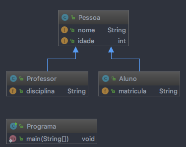

# Herança

## Definição:

A herança é um mecanismo da Orientação a Objeto que permite criar novas classes a partir de 
classes já existentes, aproveitando-se das características existentes na classe a ser estendida. 
Este mecanismo é muito interessante, pois promove um grande reuso e reaproveitamento de código 
existente.  Com a herança é possível criar classes derivadas, subclasses, a partir de classes 
bases, superclasses. As subclasses são mais especializadas do que as suas superclasses, mais 
genéricas.

## Vantagens:

* A vantagem clara é o reuso de código.

## Desvantagens:

* Alto acoplamento entre as classes envolvidas.

## Diagrama:

