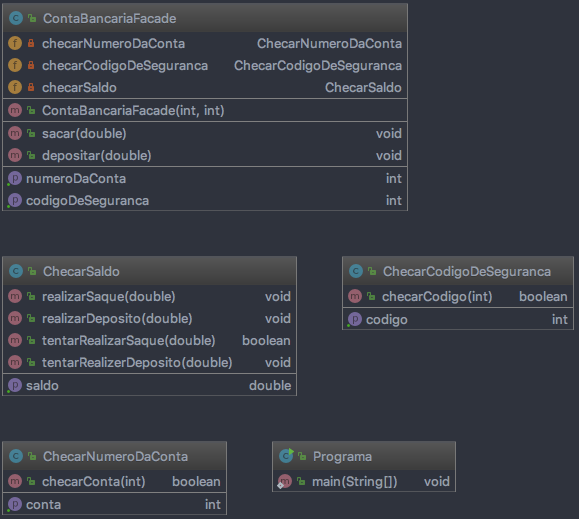

# Polimorfismo

## Definição:

Polimorfismo significa "muitas formas", é o termo definido em linguagens orientadas a objeto, 
que permite ao desenvolvedor usar o mesmo elemento de formas diferentes. Na prática, é uma herança 
com a sobreposição de um método na classe derivada.

## Vantagens:

* Facilita a generalização de algoritmos e estruturas de dados.

## Desvantagens:

* Existe alto acoplamento entre as classes envolvidas.

## Diagrama:

