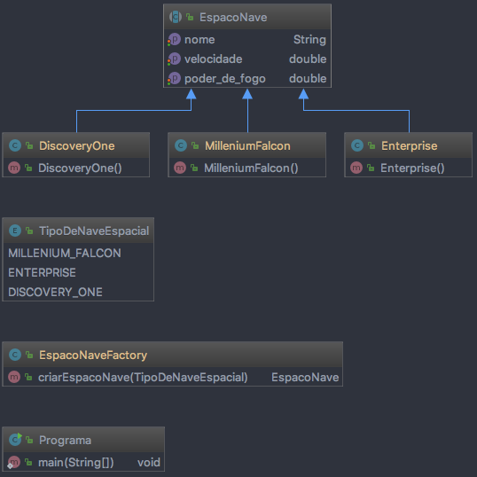

# Factory Method

## Definição:

Define uma interface para criar um objeto, mas deixa as subclasses decidirem que 
classe instanciar. O Factory Method permite adiar a instanciação para subclasses.

Composta por:

* Produto (Product): define	a interface dos objetos criados pelo Factory Method;

* Produto Concreto (Concret Product): implementa a interface Produto;

* Criador (Create): declara	os Factory Methods que retornam uma instância do Produto 
Concreto;

Cenários comuns de uso:

* Usar o padrão Factory Method quando uma classe não pode antecipar a classe de 
objetos que deve criar;

* Uma classe quer que suas subclasses especifiquem os objetos que criam.

## Vantagens:

* Fornece ganchos para subclasses: Criar objetos dentro de uma classe com método fábrica 
é sempre mais flexível do que criar um objeto diretamente. Factory Method dá às subclasses 
um gancho para fornecer uma versão estendida de um objeto.

## Desvantagens:

* Uma desvantagem em potencial dos métodos-fábrica é que os clientes podem ter que 
fornecer subclasses da classe Creator somente para criar um objeto Concret-Product em 
particular.

## Diagrama:

