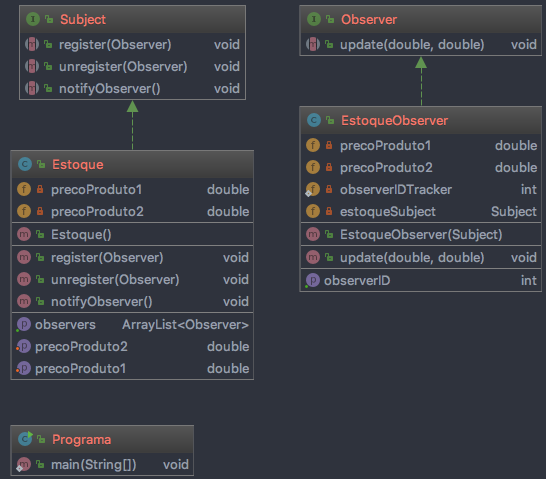

# Observer

## Definição:

Definir uma dependência um-para-muitos entre objetos, de maneira que quando um objeto muda 
de estado todos os seus dependentes são notificados e atualizados automaticamente.

É composto por:

* Subject (Publisher): conhece os seus observadores. Um número qualquer de objetos Observer pode 
observar um subject. Fornece uma interface para acrescentar e remover objetos, 
permitindo associar e desassociar observer.

* Observer (Subscribers): define uma interface de atualização para objetos que deveriam 
ser notificados sobre mudanças em um Subject.

Cenarios mais comuns de uso: 
* O padrão Observer deve ser utilizado qundo uma abstração tem dois aspectos, um 
dependente do outro. Encapsulando esses aspectos em objetos separados, permite-se variá-los 
e reutilizá-los independentemente.

* Quando uma mudança em um objeto exige mudanças em outros, e não sabe-se quantos objetos 
necessitam ser mudados.

* Quando um objeto deveria ser capaz de notificar outros objetos sem fazer hipóteses, 
ou usar informações, sobre quem são esses objetos. Em outras palavras, quando não se 
deseja que esses objetos sejam fortemente acoplados.

## Vantagens:

* Acoplamento abstrato entre Subject e Observer: Tudo que o subject sabe é que ele tem uma 
lista de observadores, cada um seguindo a interface simples da classe abstrata Observer. 
O subject não conhece a classe concreta de nenhum observador. Assim, o acomplamento entre 
o subject e os observadores é abstrato e mínimo.

* Suporte para comunicação do tipo broadcast. Diferentemente de uma solicitação ordinária, 
a notificação que um subject envia não precisa especificar seu receptor. A notificação é 
transmitida automaticamente para todos os objetos interessados que a subscreveram. O 
subject não se preocupa com quantos objetos interessados existem, sua única 
responsabilidade é notificar seus observadores. Isso dá a liberdade de acrescentar e 
remover oberservadores a qualquer momento.

## Desvantagens:

* Atualizações inesperadas. Como um observador não tem conhecimento da presença dos 
outros, elas podem ser cegos para o custo global de mudança do subject. Uma operação 
inócula no subject pode causar uma cascata de atualizações nos observadores e seus objetos 
dependentes. Além do mais, critérios de dependência que não estão bem-definidas ou 
mantidos normalmente conduzem a atualizações espúrias que podem ser difíceis de detectar.

* O protocolo simples de atualização não fornece detalhes sobre o que mudou no subject. 
Sem protocolos adicionais para ajudar os observadores a descobrir o que mudou, eles podem 
ser forçados a trabalhar duro para deduzir as mudanças.

## Diagrama:

