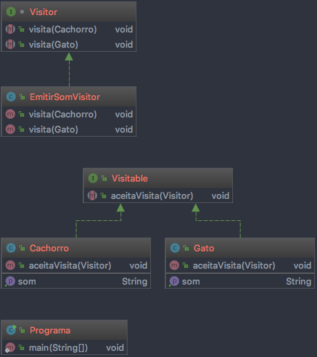

# Visitor

## Definição:

Representar uma mesma operação com implementações distintas, a ser executada 
em diferentes classes. 
Visitor permite definir uma nova operação sem mudar as classes dos elementos sobre 
os quais opera.

É uma alternativa ao uso do polimorfismo, visto que centraliza as mudanças (exemplo: a 
adição de um novo metodo comum a varias classes, mas com diferentes implementações) em 
uma única classe (Visitante Concreto).

Estrutura composta por:

* Visitante (Visitor): 
Encapsula as operações (interface). Declara uma operação de visita 
para cada classe de Visitante Concreto (ConcreteVisitor);

* Visitante Concreto (ConcreteVisitor): 
Implementa cada operação declarada pelo Visitor (atravez da interface Visitor).

* Elemento Visitante: 
Implementa uma operação aceitaVisita(), atravez da interface Visitable, que recebe um 
Visitante e chama a operação de visita apropriada deste Visitante;

## Vantagens:

* Visitor torna fácil a adição de novas operações: Os Visitors tornam fácil acrescentar 
operações que dependem dos componentes objetos complexos. Pode-se definir uma nova 
operação sobre uma estrutura de objetos simplesmente acrescentando um novo visitante.

* Um visitante reúne operações relacionadas e separa as operações não-relacionadas: 
O comportamento relacionado não é espalhado pelas classes que definem a estrutura do 
objeto, ele está localizado em um visitante. Conjuntos de comportamentos não-relacionados 
são particionados em suas próprias subclasses visitantes. Isso simplifica tanto as classes 
que definem os elementos como os algoritmos definidos nos visitantes. Qualquer estrutura 
de dados específica de um algoritmo pode er ocultada no visitante.

## Desvantagens:

* É difícil acrescentar novas classes Elemento Concreto. O padrão Visitor torna difícil 
 acrescentar novas subclasses de Element. Cada novo Elemento Concreto dá origem a 
 novas operações abstratas em Visitor e uma correspondente implementação em cada classe 
 ConcreteVisitor.

## Diagramas:

Exemplo 1:

Exemplo 2:

